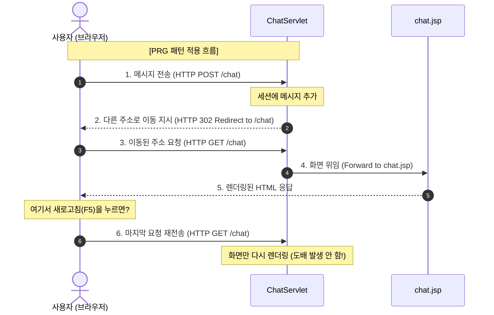

# 01. Servlet & JSP 기반의 기본 채팅 구현 (MVC & PRG 패턴)

본 문서에서는 프로젝트의 첫 번째 단계인 **Servlet과 JSP를 활용한 기본 채팅 기능 구현**에 대해 설명합니다. 웹 개발 초심자부터 면접을 준비하는 주니어 개발자까지 모두 이해할 수 있도록 비유, 내부 원리, 그리고 예상 면접 질문을 정리했습니다.

관련 소스 코드:
* [ChatServlet.java](src/main/java/com/example/justchat/ChatServlet.java)
* [chat.jsp](src/main/webapp/WEB-INF/chat.jsp)
* [pom.xml](pom.xml)

---

## 1. 🐣 초심자를 위한 쉬운 비유

웹 애플리케이션의 동작 방식을 **식당(Restaurant)**에 비유해 봅시다.

| 구성 요소 | 식당에서의 역할 | 웹 애플리케이션에서의 역할 |
| :--- | :--- | :--- |
| **Servlet (서블릿)** | **주방장 (Chef)** | 클라이언트의 요청(Request)을 받아 비즈니스 로직을 처리하고, 데이터를 가공(Model)하여 어떤 화면을 보여줄지 결정합니다. |
| **JSP (Java Server Pages)** | **플레이팅/서빙 직원** | 주방장이 가공한 데이터(재료)를 받아서 HTML/CSS라는 접시(View)에 예쁘게 담아 손님(브라우저)에게 제공합니다. |
| **Session (세션)** | **단골 손님 장부** | 서버가 손님을 기억하기 위해 기록해두는 메모장입니다. 손님이 다시 방문했을 때 이전 대화 기록(채팅 로그)을 이어서 보여줄 수 있게 합니다. |
| **PRG (Post-Redirect-Get)** | **주문 중복 방지 번호표** | 손님이 주문을 마친 후 영수증과 대기 번호표를 쥐어주어, 손님이 실수로 주문서(Post)를 다시 제출(새로고침)하지 않도록 하는 안전장치입니다. |

---

## 2. 💻 주니어를 위한 내부 원리 설명

### A. HTTP Servlet Lifecycle과 요청 처리
톰캣(Tomcat)과 같은 서블릿 컨테이너는 클라이언트 요청이 들어오면 등록된 서블릿(`@WebServlet("/chat")`)의 인스턴스를 메모리에 로드하고 관리합니다.
* **`doGet()`**: 주로 화면을 처음 보여주거나 데이터를 조회할 때 호출됩니다. 여기서는 대화창 화면인 `chat.jsp`로 포워딩(`forward`)하여 화면을 렌더링합니다.
* **`doPost()`**: 사용자가 메시지를 입력하고 전송 버튼을 누르면 호출됩니다. 입력 값을 파싱하고, 세션에 대화 내용을 저장한 뒤 중복 제출을 막기 위해 리다이렉트(`sendRedirect`)를 수행합니다.

### B. Session(세션)을 통한 대화 상태 유지
HTTP 프로토콜은 연결을 계속 유지하지 않는 **무상태(Stateless)** 프로토콜입니다. 따라서 사용자가 메시지를 보낼 때마다 이전 대화 내역을 기억할 수 없습니다.
1. 사용자가 처음 접속하면 서버는 고유한 `JSESSIONID`를 발급하고, 브라우저의 쿠키에 저장합니다.
2. 브라우저는 이후 요청마다 이 `JSESSIONID`를 헤더에 실어 보냅니다.
3. 서버는 메모리 공간에서 해당 ID에 매핑된 `HttpSession` 객체를 찾아 대화 목록(`ArrayList<String>`)을 유지합니다.

### C. PRG (Post - Redirect - Get) 패턴
PRG 패턴은 웹 애플리케이션에서 거의 공식처럼 쓰이는 설계 패턴입니다.

* **만약 PRG를 쓰지 않고 POST 요청에 바로 JSP로 Forward한다면?**
  사용자가 화면을 **새로고침(F5)**할 때 브라우저는 직전에 보냈던 **HTTP POST 요청을 재전송**합니다. 결과적으로 똑같은 메시지가 세션에 계속해서 추가되어 게시판 도배 혹은 결제 중복 등의 심각한 에러가 발생합니다.
* **PRG 패턴의 해결책:**
  POST 요청 처리가 끝나면 서버는 클라이언트에게 `302 Found` 상태 코드와 함께 `Location: chat` 헤더를 담아 응답합니다. 브라우저는 이를 받아 즉시 **GET 방식으로 `/chat` 페이지를 다시 요청**하므로, 이후 새로고침을 하더라도 안전한 GET 요청만 반복됩니다.

---

## 3. 📊 핵심 개념 비교표

### Forward vs Redirect

| 비교 항목 | Forward (포워드) | Redirect (리다이렉트) |
| :--- | :--- | :--- |
| **이동 방식** | 서버 내부에서 다른 서블릿/JSP로 실행 흐름만 위임 | 서버가 클라이언트에게 다른 URL로 다시 요청하라고 지시 |
| **URL 주소 표시** | 최초 요청 시의 URL이 웹 브라우저에 그대로 유지됨 | 새로운 주소로 웹 브라우저의 URL이 변경됨 |
| **객체 재사용** | 동일한 Request, Response 객체를 공유함 | 기존 Request, Response가 소멸하고 완전히 새로 생성됨 |
| **HTTP 상태 코드** | 200 OK (내부 이동이므로 외부엔 성공으로 보임) | 302 Found (새로운 경로로 재요청을 유도함) |
| **주요 용도** | 컨트롤러(Servlet)에서 뷰(JSP)로 화면 처리를 넘길 때 | 등록/수정/삭제 처리(POST) 후 화면 조회(GET)로 전환할 때 |

---

## 4. 👩‍💻 면접 대비 예상 Q&A

### Q1. Servlet과 JSP의 차이점과 MVC 패턴에서 각각의 역할은 무엇인가요?
* **답변**: **Servlet**은 자바 클래스 내에 HTML 코드를 작성하는 기술로, 로직 처리에 특화되어 MVC 패턴의 **Controller** 역할을 담당합니다. 반면 **JSP**는 HTML 문서 내에 자바 코드를 삽입하는 기술로, 화면 설계에 특화되어 **View** 역할을 담당합니다. 서블릿이 클라이언트 요청을 받아 데이터(Model)를 준비하고, 이를 JSP에 전달하여 최종 사용자에게 화면을 보여주는 방식으로 역할을 분담합니다.

### Q2. PRG(Post-Redirect-Get) 패턴은 왜 사용하며, 사용하지 않았을 때 어떤 문제가 발생하나요?
* **답변**: 클라이언트의 POST 요청 처리 후 새로고침으로 인한 **중복 요청 및 중복 데이터 처리 문제**를 방지하기 위해 사용합니다. 만약 PRG 패턴을 쓰지 않고 POST 요청에 곧바로 화면을 포워딩하면, 사용자가 새로고침을 누를 때마다 동일한 POST 요청이 계속 전송되어 중복 결제, 중복 게시글 등록 등의 심각한 비즈니스 로직 오류가 발생할 수 있습니다.

### Q3. HTTP Session은 어떻게 클라이언트를 식별하고 데이터를 유지하나요?
* **답변**: HTTP는 무상태(Stateless) 프로토콜이지만, 서버는 클라이언트가 첫 접속 시 고유한 세션 ID(`JSESSIONID`)를 발급하여 브라우저 쿠키에 저장하도록 합니다. 이후 브라우저가 매 요청마다 쿠키 헤더에 이 세션 ID를 실어 보내면, 서버는 자신의 세션 메모리 영역에서 매핑되는 세션 객체를 찾아 데이터를 읽고 씁니다. 이를 통해 서로 다른 클라이언트를 식별하고 각각의 상태를 유지할 수 있습니다.