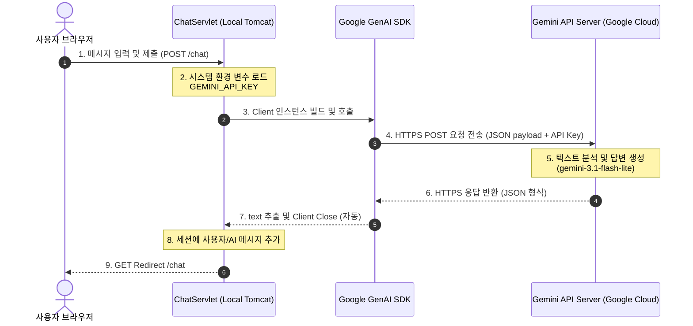

# 02. Google GenAI SDK 추가 및 Gemini API 연동

본 문서에서는 프로젝트의 두 번째 단계인 **Google GenAI SDK 설치 및 Gemini API(gemini-3.1-flash-lite) 연동**에 대해 다룹니다. 초심자를 위한 쉬운 비유부터 주니어를 위한 내부 메커니즘, 예상 면접 질문까지 총망라했습니다.

관련 소스 코드:
* [ChatServlet.java](src/main/java/com/example/justchat/ChatServlet.java)
* [pom.xml](pom.xml)
* [.env.sample](.env.sample)

---

## 1. 🐣 초심자를 위한 쉬운 비유

외부 인공지능 API를 연동하는 과정을 **식당의 업무 지원 서비스**에 비유해 보겠습니다.

| 구성 요소 | 식당에서의 역할 | 웹 애플리케이션에서의 역할 |
| :--- | :--- | :--- |
| **Gemini API** | **외부 전문 자문단 (전화 상담)** | 우리 서버가 답하기 어려운 질문에 대해 똑똑한 답변을 생성해 주는 외부 클라우드 인공지능 엔진입니다. |
| **Google GenAI SDK** | **자문단 전용 국제전화 다이얼러** | 번거로운 HTTP 통신 규약을 신경 쓰지 않고, 자바 코드로 편리하게 Gemini API와 통신할 수 있게 도와주는 도구 상자(라이브러리)입니다. |
| **API KEY (비밀키)** | **자문 서비스 멤버십 비밀번호** | 통화 연결 시 본인 확인을 하는 고유 키입니다. 타인에게 노출되면 우리 이름으로 요금이 청구될 수 있으므로 절대 코드에 적어선 안 됩니다. |
| **Environment Variable (환경변수)** | **금고 속에 넣어둔 멤버십 번호** | 컴퓨터 시스템이라는 안전한 금고 내부에 비밀번호를 숨겨두고, 주방장(서블릿)이 필요할 때마다 꺼내 쓰는 방식입니다. |

---

## 2. 💻 주니어를 위한 내부 원리 설명

### A. Google GenAI SDK 라이브러리 의존성 주입 (`pom.xml`)
프로젝트 빌드 시점에 Maven은 중앙 저장소에서 `google-genai` SDK(버전 1.60.0)를 다운로드하여 classpath에 추가합니다. 이 라이브러리는 내부적으로 HTTP 클라이언트 모듈과 JSON 파싱 도구를 품고 있어 복잡한 REST API 호출을 메소드 호출 형태로 캡슐화해 줍니다.

### B. Try-with-resources와 AutoCloseable 자원 관리
`ChatServlet.java`에서는 다음과 같은 형태로 Gemini 클라이언트를 사용하고 있습니다.

```java
try (Client client = Client.builder().apiKey(apiKey).build()) {
    GenerateContentResponse response = client.models.generateContent(model, message, config);
    return response.text();
}
```

* **동작 원리**: `com.google.genai.Client` 객체는 내부적으로 네트워크 소켓 풀(Connection Pool) 등의 IO 리소스를 점유합니다.
* **`AutoCloseable` 구현**: `Client` 클래스는 `AutoCloseable` 인터페이스를 구현하고 있습니다. 자바의 `try-with-resources` 구문을 사용하면, `try` 블록이 정상 종료되거나 예외가 발생하더라도 JVM이 자동으로 `client.close()` 메소드를 호출하여 소켓 리소스를 반환하고 메모리 누수(Memory Leak)를 예방합니다.

### C. API 통신 프로세스 (Sequence Diagram)
Servlet이 사용자의 메시지를 받고 외부 Gemini API 서버와 요청/응답을 주고받는 내부 흐름은 다음과 같습니다.



---

## 3. 📊 Gemini API 핵심 파라미터 정보

API 호출 시 모델에 전달하는 `GenerateContentConfig` 설정 매개변수의 의미는 다음과 같습니다.

| 설정 변수 | 기본 의미 | 조절 시 발생하는 효과 |
| :--- | :--- | :--- |
| **`model`** | 사용할 AI 모델 종류 (예: `gemini-3.1-flash-lite`) | 연동 성능 및 비용을 결정합니다. lite 모델은 가볍고 빠른 처리에 용이합니다. |
| **`apiKey`** | API 호출 인가를 위한 식별 정보 | 누락 시 401 Unauthorized 에러가 발생하며 호출이 거부됩니다. |
| **`temperature`** | 답변의 다양성/창의성 수준 (0.0 ~ 2.0) | 값이 낮을수록 일관되고 결정론적인 답변을, 높을수록 창의적이고 다양한 답변을 얻습니다. |
| **`maxOutputTokens`** | 생성할 답변의 최대 토큰(글자 단위) 수 한도 | 출력되는 답변의 길이를 제한하여 의도하지 않은 토큰 요금 폭탄을 방지합니다. |

---

## 4. 👩‍💻 면접 대비 예상 Q&A

### Q1. API Key와 같은 민감한 정보를 소스 코드에 하드코딩하지 않고 환경 변수로 관리해야 하는 이유는 무엇인가요?
* **답변**: 보안성과 유지보수성 때문입니다. API Key를 코드에 직접 작성하면 GitHub 같은 공개 원격 저장소에 업로드되었을 때 키가 탈취되어 악용될 수 있습니다. 시스템 환경 변수로 관리하면 소스 코드와 자격 증명을 분리할 수 있으며, 개발 환경(Local), 검증 환경(Dev), 운영 환경(Prod)마다 각각 다른 키를 유연하게 바인딩할 수 있어 유연해집니다.

### Q2. Java에서 `try-with-resources` 구문의 작동 원리와 장점은 무엇인가요?
* **답변**: `try-with-resources`는 Java 7에서 도입된 기능으로, `AutoCloseable` 인터페이스를 구현한 자원을 선언할 때 사용할 수 있습니다. `try` 블록이 완료되거나 예외가 발생하면 컴파일러가 자동으로 `finally` 블록처럼 `close()` 메소드를 호출해 줍니다. 수동으로 `close()`를 호출할 때 발생할 수 있는 누락 실수나, 자원 해제 중 발생하는 2차 예외(suppressed exception) 누락 문제를 예방해 주므로 리소스 관리가 안전해집니다.

### Q3. LLM API 설정 중 `temperature` 파라미터의 역할에 대해 설명해 주세요.
* **답변**: `temperature`는 모델의 텍스트 생성 확률 분포를 조절하여 결과의 '창의성' 혹은 '정확성'을 제어하는 파라미터입니다. 값을 낮추면(예: 0.2) 가장 높은 확률을 가진 단어 위주로 선택되어 고정되고 일관성 있는 사실 위주의 답변이 생성됩니다. 반대로 값을 높이면(예: 1.0 이상) 다양한 단어가 선택되어 창의적이고 감성적인 글쓰기에 유리하지만, 엉뚱한 거짓 답변(환각 현상)을 유발할 가능성이 높아집니다.