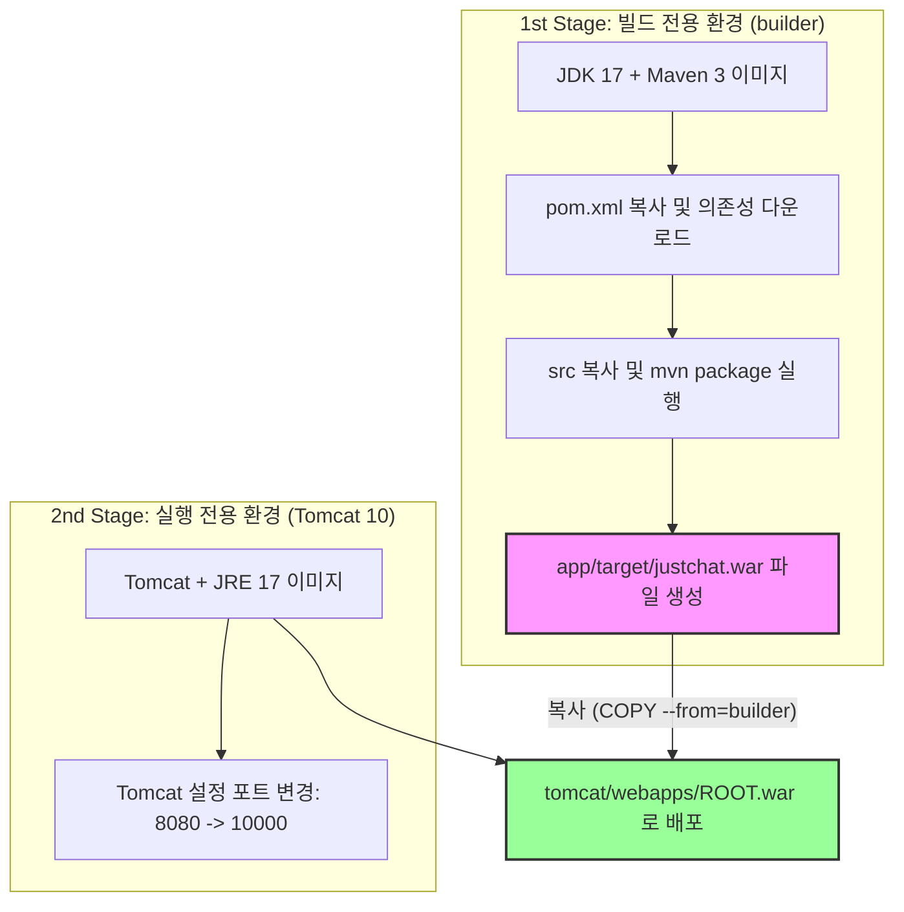

# 03. Docker Multi-stage 빌드와 Render 클라우드 배포

본 문서에서는 프로젝트의 세 번째 단계인 **Dockerfile 작성, Docker Multi-stage 빌드를 통한 최적화, 그리고 Render 클라우드 플랫폼으로의 서비스 배포 과정**에 대해 설명합니다.

관련 소스 코드:
* [Dockerfile](Dockerfile)
* [pom.xml](pom.xml)

---

## 1. 🐣 초심자를 위한 쉬운 비유

웹서비스를 배포하는 복잡한 과정을 **밀키트 전문 기업**에 비유해 봅시다.

| 구성 요소 | 식당/밀키트에서의 역할 | 웹 배포 환경에서의 역할 |
| :--- | :--- | :--- |
| **Docker (도커)** | **완성형 밀키트 (Meal Kit)** | 소스 코드, 서버 환경, 설정 등을 상자에 고스란히 밀봉하여, 어떤 운영체제(OS)에서 실행하더라도 동일하게 실행되게 보장하는 컨테이너 기술입니다. |
| **Multi-stage 빌드** | **재료 손질실과 조리 매장의 분리** | 밀키트를 포장할 때 흙이 묻은 채소(소스 코드)를 다듬는 넓은 작업 공간(Maven 빌드)과, 깨끗한 알맹이만 서빙하는 전용 매장(Tomcat 런타임)을 나누어 포장 상자(최종 이미지)의 크기를 최소화하는 기술입니다. |
| **Render (렌더)** | **밀키트 전용 위탁 판매점** | 우리가 만든 밀키트(Docker 이미지)를 전달하면, 매장을 대신 열어주고, 손님들의 유입 경로(도메인/포트 바인딩)를 교통 정리해 주는 호스팅 서비스입니다. |

---

## 2. 💻 주니어를 위한 내부 원리 설명

### A. Docker Multi-stage Build의 원리
전통적인 방식의 Docker 빌드는 빌드 환경(Maven, JDK 등)과 실행 환경(JRE, Tomcat 등)이 단일 이미지에 뭉쳐 있어 용량이 수 기가바이트(GB)에 달했습니다. Multi-stage 빌드는 이를 해결합니다.



* **보안성**: 최종 배포 이미지에 컴파일러나 자바 소스 코드(`src/`)가 포함되지 않아 코드 노출 위협이 없습니다.
* **경량화**: JDK보다 가벼운 JRE 환경에 Tomcat만 남기므로 최종 빌드 용량이 대폭 축소됩니다.

### B. Docker 레이어 캐싱 (Layer Caching) 최적화
Dockerfile을 설계할 때 작성 순서가 매우 중요합니다.

```dockerfile
# 1. 의존성 정의 파일 복사 및 라이브러리 캐싱
COPY pom.xml .
RUN mvn dependency:go-offline

# 2. 소스 코드 복사 및 패키징
COPY src ./src
RUN mvn clean package -DskipTests
```
자바 소스 코드(`src/`)는 개발 중에 매우 빈번하게 수정되지만, 라이브러리 의존성(`pom.xml`)은 거의 바뀌지 않습니다.
* 의존성 다운로드 단계를 소스 복사 단계보다 **앞선 레이어**로 분리함으로써, 소스 코드가 수정되어도 `mvn dependency:go-offline` 레이어는 캐시된 데이터를 그대로 사용하여 빌드 시간이 수 분에서 수 초로 단축됩니다.

### C. Tomcat 설정 파일 (`server.xml`) 내부 수정
Render와 같은 PaaS 플랫폼은 대개 `10000`번 또는 플랫폼이 지정한 동적 포트로 컨테이너가 바인딩되기를 원합니다. 또한 외부 제어 포트를 차단해야 합니다.
```dockerfile
RUN sed -i 's/port="8080"/port="10000"/g' /usr/local/tomcat/conf/server.xml && \
    sed -i 's/port="8005"/port="-1"/g' /usr/local/tomcat/conf/server.xml
```
* **포트 변경(`8080 -> 10000`)**: Tomcat의 기본 웹 포트인 8080을 외부와 통신 가능한 10000 포트로 강제 변경합니다.
* **셧다운 포트 비활성화(`8005 -> -1`)**: Tomcat은 기본적으로 8005번 포트로 `SHUTDOWN` 명령을 받으면 종료됩니다. 하지만 컨테이너 환경에서는 불필요하며, 해킹이나 오작동 방지를 위해 `-1`로 설정하여 비활성화하는 것이 보안 권장 사항입니다.

---

## 3. 📊 Dockerfile 핵심 지시어 가이드

| 지시어 | 설명 | 프로젝트 적용 사례 |
| :--- | :--- | :--- |
| **`FROM`** | 베이스 이미지를 설정하고 빌드 스테이지를 시작 | `FROM tomcat:10-jre17-temurin` |
| **`WORKDIR`** | 이후 명령어가 실행될 컨테이너 내 작업 디렉토리 설정 | `WORKDIR /app` |
| **`COPY`** | 호스트 컴퓨터의 파일/폴더를 컨테이너 빌드 환경으로 복사 | `COPY pom.xml .` |
| **`RUN`** | 셸 명령어를 실행하여 새로운 레이어를 생성 | `RUN mvn clean package -DskipTests` |
| **`EXPOSE`** | 컨테이너가 런타임에 리스닝할 포트를 명시 (문서화 용도) | `EXPOSE 10000` |
| **`CMD`** | 컨테이너가 시작될 때 기본적으로 실행할 명령어 정의 | `CMD ["catalina.sh", "run"]` |

---

## 4. 👩‍💻 면접 대비 예상 Q&A

### Q1. Docker Multi-stage 빌드를 사용하는 이유와 이를 통해 얻을 수 있는 이점은 무엇인가요?
* **답변**: 애플리케이션의 **빌드 단계**와 **실행 단계**를 완전히 격리하여 **최종 배포용 이미지 용량을 최소화**하고 **보안을 강화**하기 위해 사용합니다. 컴파일이나 의존성 해결을 위해 필요한 무거운 도구(Maven, JDK 등)는 빌드 스테이지에서만 사용하고 버린 뒤, 실행 스테이지에는 가벼운 실행 런타임(Tomcat, JRE)과 빌드 산출물(WAR)만 복사함으로써 가볍고 안전한 컨테이너 이미지를 생성할 수 있습니다.

### Q2. Dockerfile 작성 시 소스 코드 복사 전에 `pom.xml`을 복사하고 `mvn dependency:go-offline`을 먼저 수행하는 이유는 무엇인가요?
* **답변**: **Docker의 레이어 캐싱 메커니즘을 효율적으로 활용하기 위해서**입니다. Docker는 빌드 시 파일 변경이 없는 레이어를 재사용(캐싱)합니다. 소스 코드는 빈번히 바뀌지만 의존성 라이브러리는 자주 바뀌지 않으므로, 변경 빈도가 낮은 의존성 처리 레이어를 먼저 생성합니다. 이렇게 하면 코드가 변경되어도 이미 다운로드된 라이브러리는 캐시를 타게 되어 빌드 속도가 획기적으로 개선됩니다.

### Q3. 컨테이너 환경에서 Tomcat의 셧다운 포트(8005)를 비활성화(`-1`)해야 하는 이유는 무엇인가요?
* **답변**: 보안 강화와 무중단 관리를 위함입니다. 로컬 톰캣 구동 환경에서는 정상 종료를 위해 8005번 포트로 셧다운 명령을 보낼 수 있지만, 컨테이너 환경에서는 오케스트레이션 도구(Docker, Kubernetes 등)가 컨테이너 프로세스 자체(`SIGTERM` 시그널)를 제어하므로 셧다운 포트가 필요 없습니다. 만약 셧다운 포트를 열어두면 악의적인 내부 침입자가 해당 포트로 무단 종료 명령을 날려 서비스를 마비시킬 리스크가 존재하기 때문에 `-1`로 설정하여 원천 차단합니다.